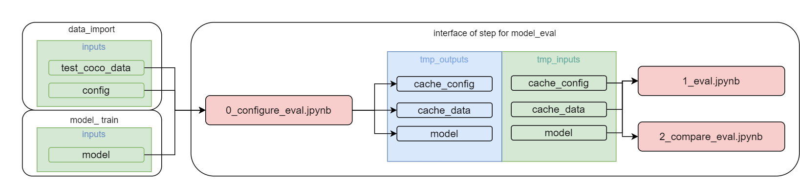

# Step CV-Pipeline: model_eval [RU](README_RU.md)

Task:
- Processing the test dataset.

This step CV-Pipeline: model_eval is intended for:
Testing the model, building metrics and graphs. If this is an improvement stage, then pull up the previous predictors and plot them on a graph (so that you have something to compare with). There can be several test sets - be sure to indicate what kind of test split is in the parameters. For detectors, the construction of a Precision-Recall curve is mandatory (code). Metrics should be described as being counted. For classification: visualization of several examples with the greatest error, sorted in descending order of error. For detectors it is mandatory: FP - red, FN - blue, GT - green. Add viewing parameters to the parameters (number of examples, type of error, etc.).

Created based on [template](https://github.com/4-DS/step_template).
In order not to forget about the required cells in each laptop, the easiest way to create new jupyter notebooks is simply by copying [`substep_full.ipynb`](https://github.com/4-DS/step_template/blob/main/substep_full.ipynb) from standard [template](https://github.com/4-DS/step_template).

Input data for step CV-Pipeline: model_eval
- **test_data**     
Test image dataset saved in parquets (from the CV-Pipeline component: data_prep)

- **test_config**     
Annotations and test image dataset (from the CV-Pipeline component: data_prep)

- **bento_service**     
bento_service, packaged model service via BentoML (from CV-Pipeline component: model_pack)

## How to run a step CV-Pipeline: model_eval

### Create a directory for the project (or use an existing one)
```
mkdir yolox_mmdet
cd yolox_mmdet
```  

### clone the repository: model_eval
```
git clone --recurse-submodules https://gitlab.com/yolox_mmdet/model_eval.git {dir name for model_eval}
cd model_eval
```  

### run step CV-Pipeline:model_eval
```
python step.dev.py
```  
or
```
step.prod.py
``` 